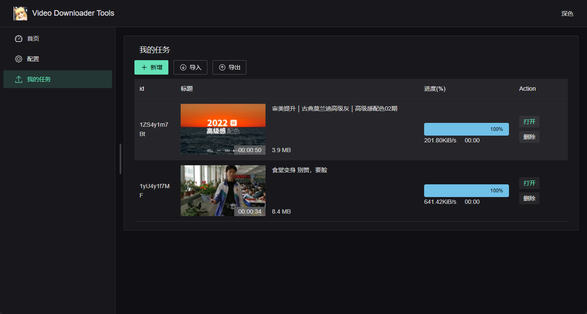

# Video Downloader

使用 vitejs + vue + electron 17 打造的视频下载工具

## 使用视频

https://www.bilibili.com/video/BV1vq4y1v7by/

## 截图



## Feature

- [x] 视频下载
- [x] 可执行文件检查与下载
  - [x] unix 系统可执行文件权限限制
- [x] 代理下载
  - [x] 图片封面代理
- [x] 进度条
- [x] 多线程下载 (yt-dlp maybe support)
- [ ] 删除下载文件
- [ ] 删除下载文件

## How to use

```bash
# install dependencies
pnpm i --frozen-lockfile

# run in developer mode
pnpm dev # npm run dev

# build
pnpm build # npm run build
```

## standard-version

- [use it](https://github.com/conventional-changelog/standard-version#first-release)
- [docs](https://www.conventionalcommits.org/zh-hans/v1.0.0/)

```bash
$ pnpm release -- --first-release
$ pnpm release -- --prerelease

$ pnpm release -- --release-as minor
$ pnpm release -- --release-as patch
$ pnpm release -- --release-as major
$ pnpm release -- --release-as 1.1.0

$ pnpm release -- --no-verify
```
